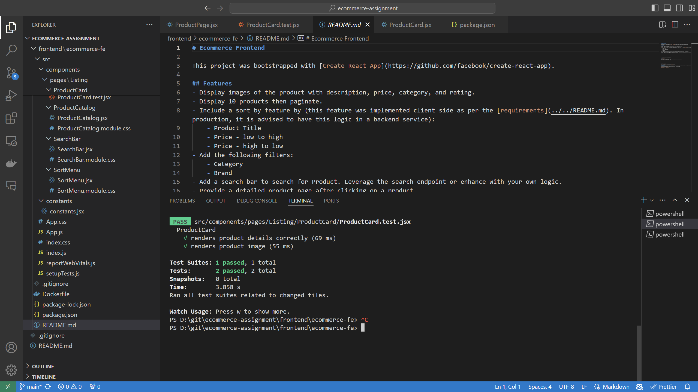

# Ecommerce Frontend

This project was bootstrapped with [Create React App](https://github.com/facebook/create-react-app).

## Features
- Display images of the product with description, price, category, and rating.
- Display 10 products then paginate.
- Include a sort by feature by (this feature was implemented client side as per the [requirements](../../README.md). In production, it is advised to have this logic in a backend service):
    - Product Title
    - Price - low to high
    - Price - high to low
- Add the following filters:
    - Category
    - Brand
- Add a search bar to search for Product. Leverage the search endpoint or enhance with your own logic.
- Provide a detailed product page after clicking on a product.
- Provide a main product image along with all the product detail information provided by the product endpoint.

### Sample Unit Test location

[ProductCard unit Test](./src/components/pages/Listing/ProductCard/ProductCard.test.jsx)

## Development Scripts

In the project directory, you can run:

### `npm start`

Runs the app in the development mode.\
Open [http://localhost:3000](http://localhost:3000) to view it in your browser.

### `npm test`

Launches the test runner in the interactive watch mode.

### `npm run build`

Builds the app for production to the `build` folder.\

### Deployment
You can use the Dockerfile present in the project directory to create an image that can be run a VM/container.
Run the following command in the project directory to build the image:

`docker build -t "ecommerce-fe" .`
